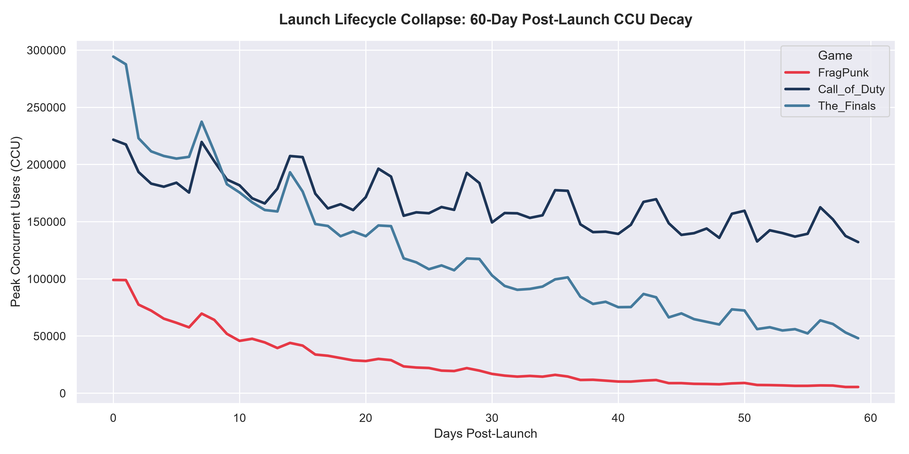
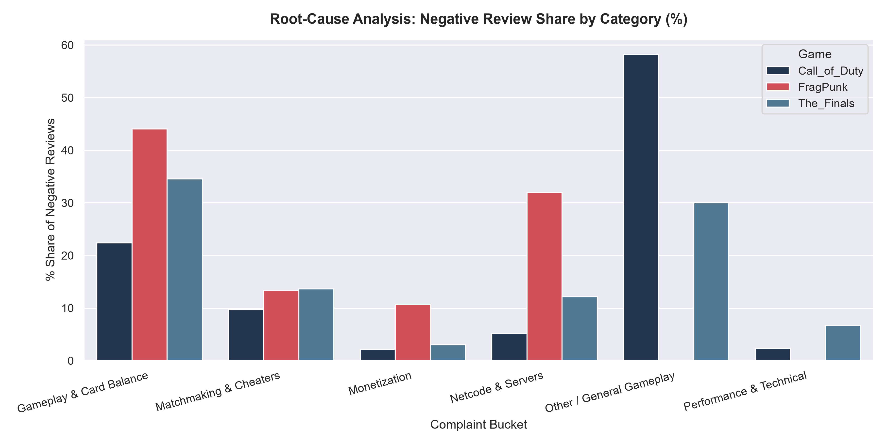
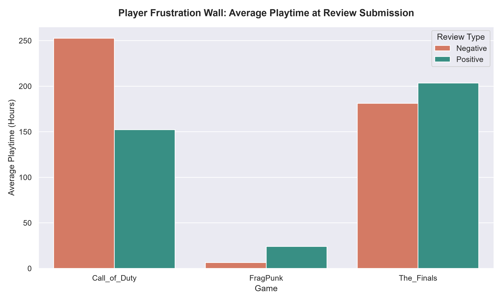

# FragPunk Launch Failure Post-Mortem: Diagnosing Initial Player Churn

## Executive Summary
* **82.9% Player Decay in 30 Days:** FragPunk experienced an 82.94% collapse in peak concurrent users (CCU) within its first 30 days post-launch, dropping from a peak near 99,000 down to ~16,900 CCU.
* **Dual Root-Cause Driver:** NLP text categorisation across player reviews revealed that **76.04%** of negative sentiment stemmed from two core issues: **Gameplay & Card Balance (44.05%)** and **Netcode & Server Desync (31.99%)**.
* **Rapid Player Bounce:** Players submitted negative reviews after logging a median of only **6.34 hours** of playtime (compared to 181+ hours for *The Finals* and 252+ hours for *Call of Duty*), highlighting a severe early-game frustration wall in the initial user experience.

---

## Data Pipeline Architecture

```
Steam API / Web  ────►  Python Scrapers  ────►  SQLite Database  ────►  NLP Sentiment Engine  ────►  Matplotlib Visuals
 (AppIDs & CCU)       (requests / pandas)    (game_analytics.db)      (VADER & Keyword N-Grams)    (3 Executive Visuals)
```

1. **Extraction:** Python scrapers fetch live review payloads via Steam endpoints and compile 60-day post-launch daily CCU metrics.
2. **Storage:** Ingested into a relational SQLite database (`game_analytics.db`) with structured tables (`daily_player_metrics`, `game_reviews`).
3. **Transformation:** Analytical SQL CTEs and aggregation queries compute 30-day collapse rates ($CR_{30}$) and playtime thresholds.
4. **NLP Diagnostics:** VADER calculates compound sentiment polarity scores while keyword N-gram parsing maps negative reviews into 5 complaint categories.
5. **Visualisation:** Visual deck rendering time-series lifecycle curves, complaint distribution percentages, and playtime threshold comparisons.

---

## Key SQL Findings

| Game Name | Launch Peak CCU | Day 30 CCU | $CR_{30}$ (%) | Negative Review Share | Avg Neg Playtime (hrs) |
| :--- | :--- | :--- | :--- | :--- | :--- |
| **FragPunk** | 99,041 | 16,901 | **82.94%** | **64.70%** | **6.34** |
| **The Finals** | 294,339 | 103,027 | 65.00% | 33.00% | 181.25 |
| **Call of Duty** | 221,704 | 149,327 | 32.65% | 50.50% | 252.69 |

---

## Key Visuals & Findings

### 1. The 60-Day Lifecycle Collapse

* **Finding:** While *Call of Duty* maintains a stable floor and *The Finals* achieves retention stabilisation around Day 25, FragPunk suffers a continuous steep drop without finding a floor in the first 60 days.

### 2. Root-Cause Complaint Distribution

* **Finding:** Card RNG balance (44.05%) and server netcode/desync (31.99%) dwarf all other complaints for FragPunk. Unlike *Call of Duty*, whose complaints are broadly scattered across general frustration (58.22%), FragPunk's churn is tightly localised in core mechanics and network stability.

### 3. Playtime Frustration Threshold

* **Finding:** FragPunk players hit an impassable frustration wall in under 7 hours. Established live-service titles retain negative reviewers for over 180 hours, showing high engagement despite dissatisfaction.

---

## Strategic Recommendations for Game Producers

1. **Prioritise Network Infrastructure Before Marketing Spikes:** Severe netcode desync coupled with low time-to-kill (TTK) leads to immediate player bounce in under 7 hours. Server stability must be guaranteed prior to launch.
2. **Rebalance High-RNG Card Modifiers in Ranked Modes:** Overpowered card mechanics alienate competitive players early. Introduce standardised deck pools in ranked play while confining chaotic card RNG to casual arcade modes.
3. **Rework First-Time User Experience (FTUE):** Players who leave in the first 6 hours rarely convert into long-term monetisation. Introduce structured onboarding modes where card mechanics are gradually introduced.
